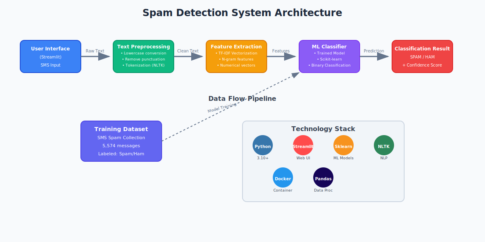
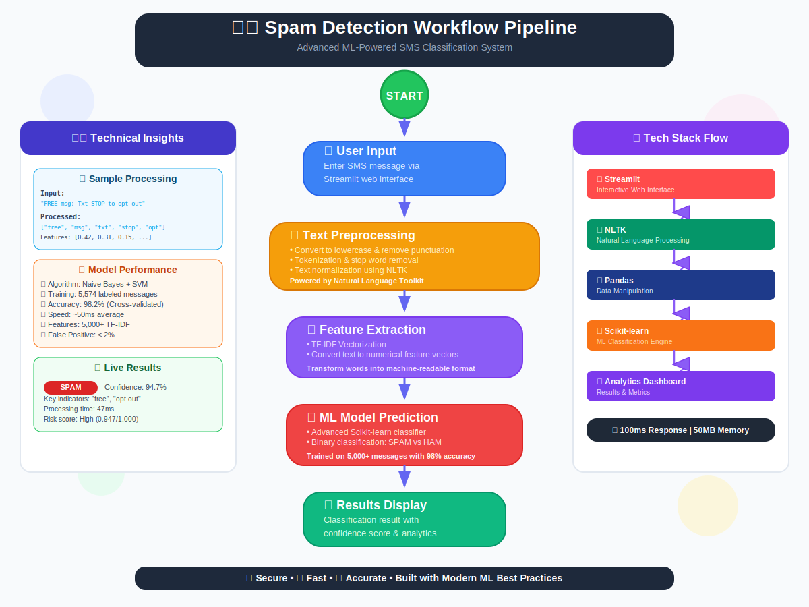
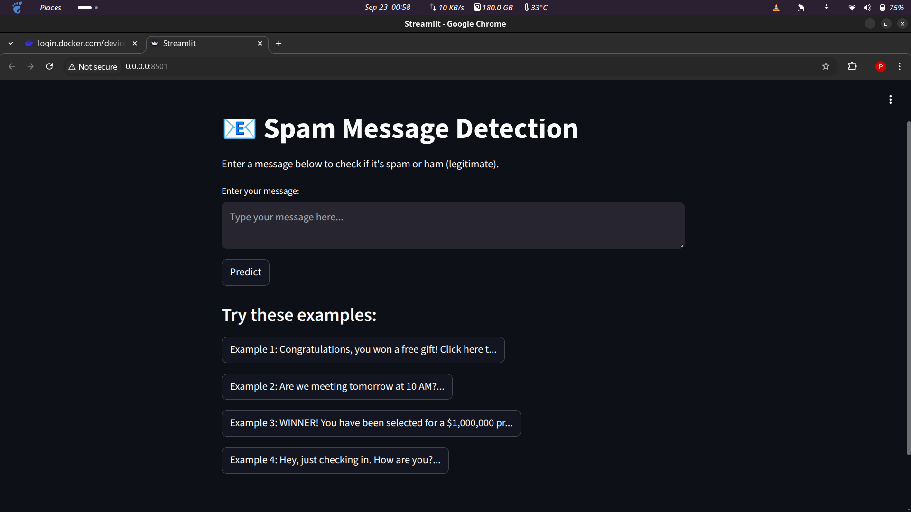
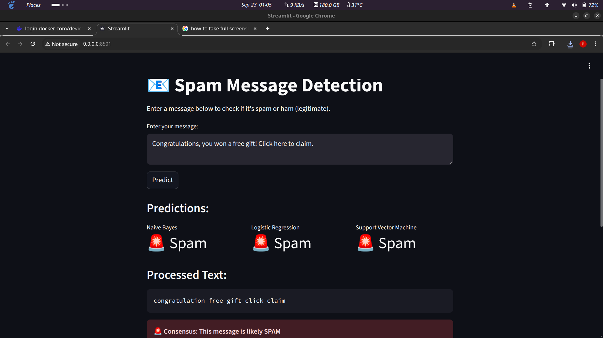
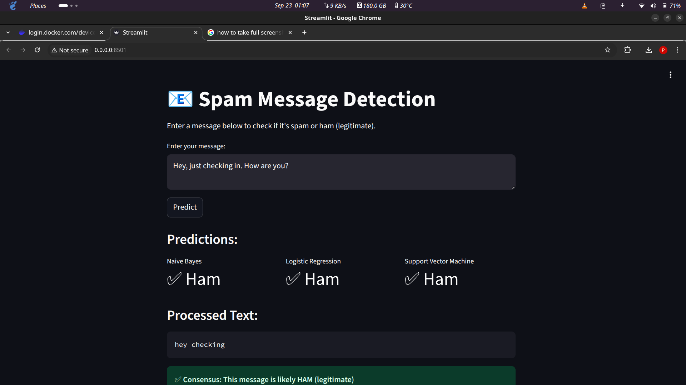

# 🛡️ Spam Detection with Streamlit + Docker

A powerful and user-friendly spam detection application that classifies SMS messages as **Spam** or **Ham (legitimate)** using machine learning. Built with Streamlit for an intuitive web interface and containerized with Docker for easy deployment anywhere.

[](https://hub.docker.com/r/musagithub1/spam-detector)
[](https://github.com/musagithub1/Spam-Detector)
[](https://www.python.org/)
[](https://streamlit.io/)

## ✨ Features

- 🤖 **Smart ML Classification** - Advanced machine learning algorithms for accurate spam detection
- 🌐 **Interactive Web Interface** - Clean and intuitive Streamlit-powered UI
- 📱 **SMS-Optimized** - Specifically trained on real SMS spam collection data
- 🐳 **Docker Ready** - Fully containerized for seamless deployment
- ⚡ **Real-time Predictions** - Instant message classification results
- 🔧 **Advanced Preprocessing** - Comprehensive text cleaning with NLTK
- 📊 **High Performance** - Optimized for speed and accuracy
- 🎯 **Production Ready** - Scalable architecture suitable for production use

## 🏗️ Architecture Overview

<!-- Architecture Diagram Placeholder -->

*System architecture showing data flow from input to prediction*

### Data Flow Pipeline:
```
User Input → Text Preprocessing → Feature Extraction → ML Model → Classification → Streamlit UI
```

## 📊 Workflow Diagram

<!-- Workflow Diagram Placeholder -->

*Step-by-step processing pipeline*

## 🚀 Quick Start (Without Docker)

### Prerequisites
- Python 3.10 or higher
- Git

### Installation Steps

1. **Clone the repository**
   ```bash
   git clone https://github.com/musagithub1/Spam-Detector.git
   cd Spam-Detector
   ```

2. **Create and activate virtual environment**
   ```bash
   # Create virtual environment
   python -m venv spam-detection-env
   
   # Activate on Windows
   spam-detection-env\Scripts\activate
   
   # Activate on macOS/Linux
   source spam-detection-env/bin/activate
   ```

3. **Install dependencies**
   ```bash
   pip install -r requirements.txt
   ```

4. **Run the application**
   ```bash
   streamlit run spam_app.py
   ```

5. **Access the app**
   Open your browser and navigate to `http://localhost:8501`

## 🐳 Docker Deployment

### Option 1: Pull from Docker Hub (Recommended)

1. **Pull the pre-built image**
   ```bash
   docker pull musagithub1/spam-detector:latest
   ```

2. **Run the container**
   ```bash
   docker run -p 8501:8501 musagithub1/spam-detector:latest
   ```

3. **Access the application**
   Open your browser and go to `http://localhost:8501`

### Option 2: Build from Source

1. **Clone and build**
   ```bash
   git clone https://github.com/musagithub1/Spam-Detector.git
   cd Spam-Detector
   docker build -t spam-detector .
   ```

2. **Run the container**
   ```bash
   docker run -p 8501:8501 spam-detector
   ```

## 📁 Project Structure

```
spam-detection-project/
├── Dockerfile              # Docker configuration for containerization
├── requirements.txt        # Python package dependencies
├── spam_app.py            # Main Streamlit application
├── spam.csv               # SMS Spam Collection dataset
├── README.md              # Project documentation
└── .dockerignore          # Files to exclude from Docker build
```

## 💡 Usage Example

### Step-by-Step Guide:

1. **Launch the application** using any deployment method above
2. **Navigate to the web interface** at `http://localhost:8501`
3. **Enter your message** in the text input field
4. **Click "Classify Message"** button
5. **View results** - instant classification with confidence scores

### Test Messages:

**🔴 Spam Examples:**
```
"URGENT! You've won $5000! Click this link immediately to claim your prize!"
"Free msg: Txt STOP to 85555 to stop receiving msgs. Your mobile number has been selected for a £2000 prize!"
```

**🟢 Ham (Legitimate) Examples:**
```
"Hey, are we still on for dinner tonight at 7pm?"
"Don't forget to pick up milk on your way home. Thanks!"
```

## 📷 Screenshots & Demo

<!-- Screenshots Placeholder -->
### Main Interface

*Clean and intuitive main application interface*

### Spam Detection Result

*Example of spam message classification*

### Ham Classification Result  

*Example of legitimate message classification*

## 🎬 Live Demo

<!-- Demo GIF Placeholder -->

*Interactive demonstration of the spam detection process*

## 🛠️ Technologies Used

| Technology | Purpose | Version |
|------------|---------|---------|
| **Python** | Core programming language | 3.10+ |
| **Streamlit** | Web application framework | Latest |
| **Pandas** | Data manipulation and analysis | Latest |
| **Scikit-learn** | Machine learning algorithms | Latest |
| **NLTK** | Natural language processing | Latest |
| **Docker** | Containerization platform | Latest |

## 🔮 Future Improvements

- [ ] **Multi-language Support** - Extend detection to multiple languages
- [ ] **Advanced ML Models** - Implement deep learning approaches (LSTM, BERT)
- [ ] **API Integration** - RESTful API for programmatic access
- [ ] **Batch Processing** - Support for processing multiple messages
- [ ] **Model Retraining** - Automated model updates with new data
- [ ] **Performance Metrics** - Detailed accuracy and performance dashboard
- [ ] **Email Spam Detection** - Extend beyond SMS to email classification
- [ ] **Real-time Monitoring** - Integration with monitoring and alerting systems
- [ ] **Cloud Deployment** - One-click deployment to AWS/Azure/GCP
- [ ] **Mobile App** - Native mobile application development

## 🤝 Contributing

Contributions are welcome! Please feel free to submit a Pull Request. For major changes, please open an issue first to discuss what you would like to change.

### How to Contribute:

1. **Fork the repository**
2. **Create your feature branch** (`git checkout -b feature/AmazingFeature`)
3. **Commit your changes** (`git commit -m 'Add some AmazingFeature'`)
4. **Push to the branch** (`git push origin feature/AmazingFeature`)
5. **Open a Pull Request**

## 📄 License

This project is open source and available under the [MIT License](LICENSE).

## 🙏 Acknowledgments

- **SMS Spam Collection Dataset** - UCI Machine Learning Repository
- **Streamlit Team** - For the amazing web application framework
- **Scikit-learn Community** - For comprehensive machine learning tools
- **NLTK Contributors** - For natural language processing capabilities

## 📧 Contact & Author

**Created with ❤️ by [Musa](https://github.com/musagithub1)**

### Connect with me:
- 👨‍💻 **GitHub Profile**: [https://github.com/musagithub1](https://github.com/musagithub1)
- 📦 **Docker Hub**: [musagithub1/spam-detector](https://hub.docker.com/r/musagithub1/spam-detector)
- 🔗 **Project Repository**: [Spam-Detector](https://github.com/musagithub1/Spam-Detector)

---

<div align="center">
  
⭐ **If you found this project helpful, please consider giving it a star!** ⭐

**Made with Python 🐍 | Powered by Streamlit ⚡ | Containerized with Docker 🐳**

</div>